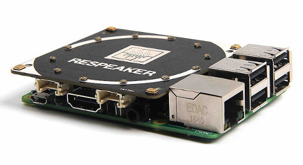

# Commande de lumières pour l'assitant vocal snips.ai.

Ceci est un premier **skill** pour [Snips](https://www.snips.ai), inspiré de "Lumière Connectée"

L'assistant allumera ou éteindra la lampe demandée

## Exemple de messages

* allume la lumière du salon
* allume la lumière de la cuisine
* éteint la lumière du salon
* ferme la lumière du canapé

## Pilotage des lumières

Les scripts **actions** font appel à une requête REST vers [Domogik](http://www.domogik.org)  pour piloter les lumières.

[Domogik](http://www.domogik.org) est un logiciel de domotique "open source".

Les lumières sont reliées à des **modules Chacon/Dio 433MHz** controlés par le plugin "Script" de **Domogik**.

## Matériels utilisés pour snips

**Raspberry-Pi3** + **ReSpeaker 4-Mic Array for Raspberry Pi**

## Animation des LEDs du 'ReSpeaker 4-Mic Array'

Dans le répertoire **4mics_hat/** se trouve le programme python [listeningSnipsEvents.py](4mics_hat/listeningSnipsEvents.py) pour piloter les LEDs du ReSpeaker en fonction des messages MQTT de Snips comme dans les exemples fourni [ici](https://snips.gitbook.io/tutorials/t/technical-guides/listening-to-intents-over-mqtt-using-python)

